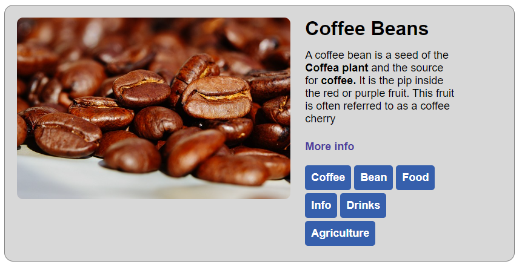

# css classes

## instructions:

1. this task starts with similar HTML to the previous task, but this time some elements have class names.
2. you will work on `index.html` and `style.css` files only.
3. no changes should be made inside `<body>` tag.
4. in `style.css` - add the proper class names from the html file to reflect the previous task's visibility
5. combine both class, id and element selectors to reach the result in the below image

.
6. do not add new classes - only edit the css.

## part 2 - full page

7. when you're done - open `page.html` with live server and link your `style.css` file. are there any problems with the display?
8. edit `style.css` to fix `page.html` if there are any problems, make sure `index.html` is still correct after. 
9. experiment with the page, add new elements and styles, be creative :)

## hints

1. The tags list is a `<ul>` element, as such, some css reset should be in order.
2. sometimes, to create proper width and height, it's enough to rely on padding the element
3. edit the links in the page and add links to wikipedia, try adding `target="_blank"` as an attribute to the `<a>` tags, what's the difference?
4. make sure to not duplicate you css code - if all elements have the same font-size - try to define it in the parent only. same with `color` and other text styles that can inherit.
5. possible background color for the tags: `#2c5eaa`

## Good Luck! 

my result 
.
